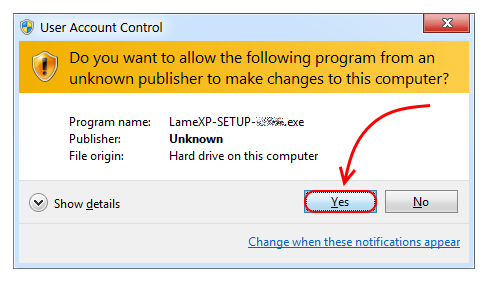
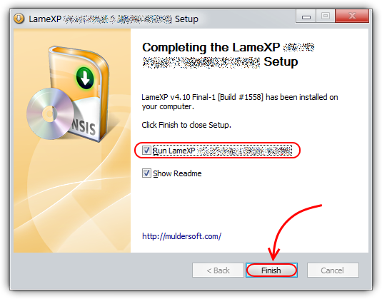
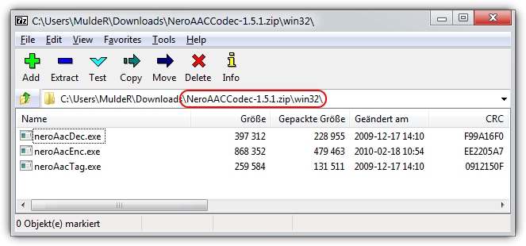

% LameXP Audio-Encoder Front-End &ndash; Manual
% Created by LoRd_MuldeR &lt;<mulder2@gmx>&gt; &ndash; check <http://muldersoft.com/> for news and updates!

# Introduction #

LameXP is a graphical user-interface (front-end) for various of audio encoders: It allows you to convert your audio files from one audio format to another one in the most simple way. Despite its name, LameXP is **not** only a front-end for the LAME MP3 encoder, but supports a wide range of *output formats*, including MP3, Ogg Vorbis, Opus, AAC/MP4, FLAC, AC-3 and Wave Audio. The number of supported *input formats* is even bigger! Furthermore LameXP **not** only runs on Windows XP, but also on Windows 7, 8 and 10 as well as many other operating systems.

Since all the encoders and decoders that are used by the LameXP software are already *built-in* (with one exception), you do **not** need to install any additional software, such as "Codecs", "Filters" or "Plug-ins", on your computer. Everything works "out of the box". You can even use LameXP as a "portable" application, i.e. you can run LameXP directly off your USB stick. Moreover, LameXP was designed for *batch processing*. This means that you can convert a huge number of audio files, e.g. a complete album or even your entire music collection, in just a single step. At the same time, LameXP is able to process several audio files *concurrently*, so it can take full advantage of modern *multi-core* processors! However, LameXP is **not** only optimized for speed, it also provides excellent sound quality by using the most sophisticated audio encoders currently available.

In addition to that, LameXP provides full support for *meta information*, including cover artwork. So when converting your audio files with LameXP, any existing meta information will be retained &ndash; to the highest possible extent. Of course, there also is an easy-to-use *meta-tag editor* for adding new meta information or managing the existing meta information. On top of it all, LameXP provides full *Unicode support*, for meta information as well as file names, thus problems with "intentional" character sets are avoided. Likewise, thanks to our *translators*, the user-interface of the LameXP software is available in many different languages, including English, German, Spanish and Chinese. Last but not least, LameXP supports a number of post-processing filters, including sample rate conversion, normalization (gain adjustment), tone adjustment as well as down-mixing.

## Platform Support##

**Tier #1:** LameXP is currently being developed on the following platforms:

* Microsoft Windows 10, 32-Bit and 64-Bit editions
* Microsoft Windows 7 with Service Pack 1, 32-Bit and 64-Bit editions
* Microsoft Windows XP with Service Pack 3 **(see remarks)**

**Tier #2:** The following platforms should work too, but aren't tested extensively:

* Microsoft Windows 8.1, 32-Bit and 64-Bit editions
* Microsoft Windows 8.0, 32-Bit and 64-Bit editions
* Microsoft Windows Vista with Service Pack 2, 32-Bit and 64-Bit editions
* Microsoft Windows XP x64 Edition with Service Pack 2
* Microsoft Windows Server 2008 with Service Pack 2
* Microsoft Windows Server 2008 R2 with Service Pack 1
* GNU/Linux (e.g. Ubuntu 12.04), using Wine v1.4+

The following *legacy* platforms are **not** actively supported any longer:

* Microsoft Windows 2000
* Microsoft Windows NT 4.0
* Microsoft Windows Millennium Edition
* Microsoft Windows 98
* Microsoft Windows 95

*Remarks:* Windows XP has reached "end of life" on April 8th, 2014. This means that Microsoft has stopped all support for Windows XP. Thus **no** updates or bugfixes are made available to regular Windows XP users since that date, **not** even security fixes! Thus, all the security vulnerabilities that have been discovered *after* the deadline &ndash; and all the security vulnerabilities that are going to be discovered in the future &ndash; will *persists* forever! Consequently, using Windows XP has become a severe security risk, and the situation is only going to get worse. While LameXP will continue to support Windows XP (note that Service Pack 3 is required!) for the foreseeable future, we *highly* recommend everybody to update to a less antiquated system now. Windows XP support will be discontinued in a future version, when most users have migrated to a contemporary system.

## Output Formats (Encoders) ##

Currently the following output formats (audio encoders) are supported by LameXP:

* [Ogg Vorbis](http://www.vorbis.com/) by [Xiph.org](http://www.xiph.org/), using the OggEnc2/libvorbis encoder with [aoTuV](http://www.xiph.org/) [built-in]
* [Opus Interactive Audio Codec](http://www.opus-codec.org/) by Xiph.org and Mozilla, using the [Opus-Tools](http://git.xiph.org/?p=opus-tools.git;a=summary) [built-in]
* [MPEG Audio-Layer III (MP3)](http://en.wikipedia.org/wiki/MP3), using the [LAME](http://lame.sourceforge.net/) encoder [built-in]
* [Advanced Audio Coding (AAC)](http://en.wikipedia.org/wiki/Advanced_Audio_Coding), using [Nero AAC](http://www.nero.com/deu/company/about-nero/nero-aac-codec.php) or [QAAC](https://sites.google.com/site/qaacpage/) encoder [*separate download*]
* [Free Lossless Audio Codec (FLAC)](https://xiph.org/flac/) [built-in]
* [ATSC A/52 (aka "AC-3")](http://www.atsc.org/cms/index.php/standards/standards/48-atsc-a52-standard), using the [Aften](http://aften.sourceforge.net/) encoder [built-in]
* [Monkey's Audio (APE)](http://www.monkeysaudio.com/), lossless audio compression [built-in]
* DCA, using the [DCA Enc](https://gitorious.org/dtsenc/dtsenc) encoder software (still experimental) [built-in]
* Uncompressed PCM / Waveform Audio File (WAV/RIFF)

## Input Formats (Decoders) ##

Currently the following input formats (audio decoders) are supported by LameXP:

* AC-3 (ATSC A/52), using Valib decoder [built-in]
* Advanced Audio Coding (AAC), using FAAD decoder [built-in]
* Apple Lossless (ALAC) [built-in]
* Apple/SGI AIFF [built-in]
* Avisynth, audio only [requires Avisynth 2.5.x to be installed]
* Digital Theater System, using Valib decoder [built-in]
* Free Lossless Audio Codec (FLAC) [built-in]
* Microsoft ADPCM [built-in]
* Monkey's Audio (APE) [built-in]
* MPEG Audio-Layer I (MP1), using mpg123 decoder [built-in]
* MPEG Audio-Layer II (MP2), using mpg123 decoder [built-in]
* MPEG Audio-Layer III (MP3), using mpg123 decoder [built-in]
* Musepack [built-in]
* Opus Audio Codec [built-in]
* Shorten [built-in]
* Speex [built-in]
* Sun/NeXT Au [built-in]
* The True Audio (TTA) [built-in]
* Uncompressed PCM / Waveform Audio File (WAV/RIFF) [built-in]
* WavPack Hybrid Lossless Audio [built-in]
* Windows Media Audio (WMA), using wma2wav [built-in]

# Leagl Information #

The LameXP software was developed, from the scratch, by LoRd_MuldeR &lt;MuldeR2@GMX.de&gt;. Consequently, all copyrights on the LameXP software exclusively belong to LoRd_MuldeR. The right to use, modify and redistribute the LameXP software *according to the license terms* is granted to everybody. Please see below for license details! If you want to use the LameXP software in a way that is *not* covered by the license terms, e.g. if you want to include the LameXP software (or parts of it) in a *proprietary* software, written permission by LoRd_MuldeR is required.

More OpenSource projects by LoRd_MuldeR can be found at <http://muldersoft.com/> and <https://github.com/lordmulder>. Please do **not** send e-mail to LoRd_MuldeR directly, if the problem or suggestion can be discussed on the support forums or on the issue tracker!

## Third-party Software ##

It has to be noticed that LameXP uses a number of *third-party* applications and libraries. The copyright on these third-party tools belongs to the individual authors. *All* third-party tools that are included in the official distribution packages of LameXP are distributed in accordance with the respective software license. For legal reasons, some of the third-party tools can *not* be redistributed along with LameXP and therefore need to be obtained separately. For more details on the third-party tools that are used by the LameXP software, please refer to the "Third-party software" tab in the "About" dialogue. Moreover, various people have contributed translations to the LameXP project. These translation are redistributed with permission of the respective contributor. For more information about our contributors, please refer to the "Contributors" tab in the "About" dialogue.

## License Terms ##

LameXP is [*free software*](http://en.wikipedia.org/wiki/Free_software_movement), released under the terms of the [*GNU General Public License* (GPL), version 2](http://www.gnu.org/licenses/gpl-2.0.html). The licenses for most software and other practical works are designed to take away your freedom to share and change the works. In contrast, the GPL is designed to guarantee your freedom to share and change all versions of the software. In other words, the GPL ensures that free software will remain free for all of its users. LameXP adds some additional terms in order to keep your computer safe from unwanted software. See the *GNU General Public License* for more details!

	LameXP - Audio Encoder Front-End
	Copyright (C) 2004-2016 LoRd_MuldeR <MuldeR2@GMX.de>

	This program is free software; you can redistribute it and/or
	modify it under the terms of the GNU General Public License
	as published by the Free Software Foundation; either version 2
	of the License, or (at your option) any later version.

	This program is distributed in the hope that it will be useful,
	but WITHOUT ANY WARRANTY; without even the implied warranty of
	MERCHANTABILITY or FITNESS FOR A PARTICULAR PURPOSE.  See the
	GNU General Public License for more details.

	You should have received a copy of the GNU General Public License
	along with this program; if not, write to the Free Software
	Foundation, Inc., 51 Franklin Street, Fifth Floor, Boston, MA  02110-1301, USA.

**Addendum:** When distributing binaries of the LameXP software, it is *strictly forbidden* to bundle the LameXP program files and/or the LameXP installation program with any kind of *Adware*, *Spyware* or *PUP (potentially unwanted program)*, including, but not limited to, any downloaders, dialers, browser toolbars/extensions or restricted shareware/demo programs. It is, however, perfectly legitimate to bundle LameXP with other *OpenSource* programs, according to the OSI (Open Source Initiative). Finally, it is also legitimate to bundle LameXP with *commercial software*, as long as that software does *not* meet the criteria of *Adware*, *Spyware* or *PUP*. If you bundle the LameXP software with another software, you are *required* to make sure that the user is provided with an easy way to install and start the LameXP software separately from that other software.

# Anti-Virus Notes #

Occasionally, it may happen that your anti-virus software *mistakenly* detects [malware](http://en.wikipedia.org/wiki/Malware) (virus, trojan horse, worm, etc.) while you are trying to run the LameXP application or the LameXP setup program. This is called a [**false positive**](http://en.wikipedia.org/wiki/Antivirus_software#Problems_caused_by_false_positives) and the file actually is **not** malware. Instead, this is an error (bug) in your particular anti-virus software! In case that you encounter this kind problem, we highly recommend using [VirusTotal.com](http://www.virustotal.com/), [Virscan.org](http://www.virscan.org/) or a similar web-service to check the file in question with *multiple* anti-virus engines. Unless the vast majority of the anti-virus engines detect malware, it can be assumed that the file is really harmless. However, please take care with *heuristic* scan results, such as "suspicious", "generic" or "packed". Those results are **not** confirmed malware detections &ndash; they are highly speculative and (almost certainly) can be ignored safely!

Defective anti-virus software is an ongoing annoyance! For example, anti-virus programs tend to suspect installers (or uninstallers) created with [NSIS](http://nsis.sourceforge.net/) &ndash; which includes the LameXP setup program. But, of course, installers created with NSIS are perfectly legitimate. Thus, if your anti-virus program complains about the LameXP setup program, please ignore the *nonsensical* warning! Furthermore, it seems that some anti-virus programs accuse *all* "packed" executables of being malware. Nonetheless, using so-called "executable packers", e.g. [UPX](http://upx.sourceforge.net/), is perfectly legitimate. Executable packers are commonly used by legitimate software, including numerous OpenSource projects &ndash; and so does LameXP. Thus, if your anti-virus program complains about the LameXP program file, because it has been "packed" by UPX, please ignore the *nonsensical* warning!

Last but not least: Always keep in mind that LameXP is *free software*, i.e. the *source codes* of LameXP are freely available to everybody! Thus, in case that you do *not* trust the provided *binaries* of LameXP, you may scrutinize the LameXP *source codes* and then build your own binaries&hellip;

## Reporting False Positives ##

An important fact to consider is, that, for the developer of a legitimate application, it is *impossible* to know **why** a specific anti-virus software may be *misinterpreting* his or her application as malware. That is because anti-virus programs generally are *proprietary* (ClosedSource) software &ndash; anti-virus companies don *not* publish their source codes or reveal their algorithms. Moreover, a zillion of *different* anti-virus programs exist nowadays. For these reasons, the application developer can *not* know what is going on "behind the scenes" in a particular anti-virus software. Consequently, any assumptions on the reasons that are causing the [**false positive**](http://en.wikipedia.org/wiki/Antivirus_software#Problems_caused_by_false_positives) would be nothing but pure speculation! Even worse, anti-virus software is updated frequently, so the reasons why the anti-virus software is *misinterpreting* the application as malware may change constantly!

At this point, it should be clear that implementing *workarounds* for defective anti-virus software is **not** a viable option for application developers. Instead, since the [**false positive**](http://en.wikipedia.org/wiki/Antivirus_software#Problems_caused_by_false_positives) is an error (bug) in the particular *anti-virus software*, it can be fixed *only* by the developer of the anti-virus software. Therefore, it is important that *you*, the (paying) customer of the anti-virus company, contact the support team of the anti-virus company and report the problem to them! Most anti-virus companies provide ways to report *false positives* in a standardized way, e.g. by means of a [webform](http://en.wikipedia.org/wiki/Form_%28HTML%29). However, it is *not* possible to list them all here. So please refer to the anti-virus developer's web-site. Also, when reporting *false positives*, please be self-confident: As a paying customer, you can demand that *false positives* get fixed in a timely manner. Otherwise, get your money back!

## Performance Issues ##

During the *startup procedure*, the LameXP software has to perform a number of *file-system* operations. This can take a few moments. However, the startup procedure should **never** take longer than *approximately* 5 seconds. Even on our test system &ndash; Windows 7 running on an *ancient* Intel Core2 processor with 4 GB of RAM &ndash; the startup procedure takes only about 1.5 seconds. And that is with the "real-time protection" of Microsoft Security Essentials (MSE) enabled! If we disable the MSE "real-time protection" feature, the startup procedure takes less than 0.5 seconds. *Unfortunately*, it has been brought to our attention, that some other anti-virus products may *slow down* the startup procedure significantly! Startup delays of up to 20 seconds have been reported by users, which corresponds to a slow down factor of **40&#xd7;** &ndash; caused by the anti-virus software!

Consequently, if you think that LameXP is starting up "slow" on your machine, we recommend to **temporarily** *disable* or *uninstall* your current anti-virus software. If your anti-virus software has a so-called "real-time protection" or "guard" feature, please be sure to *deactivate* that feature too! As soon as the anti-virus software has been *neutralized* and **no** longer affects legitimate applications, please try launching the LameXP software again. If it turns out that the startup procedure of LameXP has become significantly *faster* when the anti-virus software is **not** interfering, then you know one thing for sure: It is the *anti-virus software* that was causing the slow down! Please recognize that *we* can **not** fix this kind of problems. Instead, since the problem is actually a *defect* of the anti-virus software, please report the problem to the developer of the *anti-virus software*!

Another way of detecting performance issues caused by sloppy anti-virus software is monitoring the CPU usage in Task Manager (or [*Process Explorer*](https://technet.microsoft.com/en-us/sysinternals/bb896653.aspx)) while LameXP is starting up. Please make sure that you are **not** looking at the "overall" CPU usage, but at the CPU usage caused by the *individual* processes, and that "show processes from all users" is *enabled*. Then you will probably notice that `LameXP.exe` is sitting "idle", more or less, while some *service process* belonging to the anti-virus software is "hogging" the CPU. A typical example looks like this:

For reporting *performance issues*, please refer to anti-virus developer's web-site. Also, when reporting *performance issues*, please be self-confident: As a paying customer, you can demand that *performance issues* get fixed in a timely manner. Otherwise, get your money back!

## Anti-Virus Conclusions ##

The **code of conduct** regarding problems and annoyances related to so-called "anti-virus" software:

* If your anti-virus software raises an "alarm" or "warning" while trying to launch the LameXP software or the LameXP setup program, please don't panic and take this with a grain of salt!

* Unless the alleged "malware infection" has been confirmed by **multiple** [*different*](http://www.virustotal.com/) anti-virus engines, this almost certainly is a [**false positive**](http://en.wikipedia.org/wiki/Antivirus_software#Problems_caused_by_false_positives) and thus can be ignored safely &#x1f60a;

* In the extremely rare case that you actually have a *confirmed* malware infection, please try re-downloading the LameXP software from one of the **official** mirrors first, *before* you send us any reports!

* If you encounter any [**false positives**](http://en.wikipedia.org/wiki/Antivirus_software#Problems_caused_by_false_positives), please report these problems to the developer of the *defective* anti-virus software. *We* are **not** responsible for this problem and thus *we* can **not** fix it!

# Install Instructions #

This chapter explains how to install the LameXP software on your computer. If LameXP has already been installed on your computer, you may skip this chapter.

## Install the LameXP Software ##

Distribution packages of the LameXP software is provided in two different flavours: a self-running **setup program** and a **ZIP package**. For regular users, using the *setup program* is highly recommended!

### Setup Program ###

In order to start the installation process, simply double-click on the downloaded LameXP **setup program**, e.g. ``LameXP.yyyy-mm-dd.Release-Static.Build-xxxx.exe``.

Shortly after launching the setup program, an [UAC](http://en.wikipedia.org/wiki/User_Account_Control) (User Access Control) dialogue may appear. This is a standard Windows security feature, so don't worry! You have to choose "Yes", if you wish to continue the installation process.

*Note:* If you wonder why Windows suggests that the LameXP setup program originates from an "unknown publisher", despite the fact that it was downloaded from the official web-site, then please the explanation [here](http://lamexp.sourceforge.net/doc/Manual.html#q-why-are-the-lamexp-binaries-not-digitally-signed)!

Now simply follow the instructions of the setup wizard, which will guide you through the installation process&hellip;

*Note:* Please do **not** change the "Destionation Folder", unless you know exactly what you are doing. The "Destionation Folder" cannot be changed, when *upgrading* an existing LameXP installation.

Congratulation, LameXP has been installed successfully on your computer!

*Note:* If you keep the "Run LameXP &hellip;" option enabled and click on the "Finish" button, the LameXP software will be launched immediately.

### ZIP Package ###

If you decided for the **ZIP package**, you need to open the downloaded ZIP file, e.g. ``LameXP.yyyy-mm-dd.Release-Static.Build-xxxx.zip``, in your favourite file archive software (we recommend using [7-Zip](http://www.7-zip.org/) or [WinRAR](http://www.rarlab.com/download.htm)).

This step may be slightly different, depending on what file archive software (e.g. 7-Zip or WinRAR) you are using. Select **all** files in the LameXP ZIP archive and *extract* them to a new/empty directory of your choice.

*Note:* It is very important that you have write-access to the chosen destination directory. So make sure that you choose a directory where the required access rights are granted!

Congratulation, LameXP has been installed successfully on your computer! Now double-click on the ``LameXP.exe`` program file in order to launch the application!

## Portable Mode ##

First of all, it is important to note that there is **no** such thing as a *separate* "portable version" or "portable edition" of the LameXP software. Instead, **all** versions of the LameXP software always *are* "portable" &ndash; in the sense that the LameXP software is *fully self-contained* and thus **no** additional dependencies (libraries, frameworks, codecs or whatsoever) need to be installed on the computer separately. Or, in other words, the LameXP software is designed to work "out of the box". And this applies regardless of whether you choose the setup program or the ZIP package!

Nonetheless, the LameXP software supports a so-called "portable mode", which can be enabled or disabled at any time. By default, i.e. when the "portable mode" is **not** enabled, LameXP will store all of its configuration files in the current user's [``%APPDATA%``](http://en.wikipedia.org/wiki/Environment_variable#Windows) directory. This is the correct way of storing *user-specific* configuration files on a modern multi-user operating system. Some users, however, may wish to use LameXP as a *portable application*. For example, they may wish to run the LameXP software directly off an USB flash drive &ndash; and do that on many *different* machines. In this particular situation, storing the configuration files in the *same* location where the LameXP program file resides (e.g. on the USB flash drive), instead of the local ``%APPDATA%`` directory, may come in handy! And that is exactly what LameXP does when the "portable mode" is *enabled*.

### Enable the Portable Mode ###

If you fully understand what the consequences of the "portable mode" are and still want to *enable* this mode, then simply **rename** the LameXP program file form ``LameXP.exe`` to ``LameXP-Portable.exe``. You must exit LameXP, before you can rename the program file!

*Note:* By default, the LameXP installation directory is either ``C:\Program Files (x86)\MuldeR\LameXP`` or ``C:\Program Files\MuldeR\LameXP``. However, this can be changed by the user during the setup process.

#### Portable Mode Warning #### {-}

While the "portable mode" is in effect, it is the *user's* responsibility to ensure that LameXP will be provided with the proper access rights to save/load its configuration files to/from the LameXP program directory!

*Note:* The directories ``C:\Program Files (x86)`` and ``C:\Program Files`` usually are "protected" by the operating system, so LameXP probably will **not** be able to write into these directories.

### Disable the Portable Mode ###

If you wish to *disable* the "portable mode" again, then all you need to do is **renaming** the LameXP program file form ``LameXP-Portable.exe`` back to ``LameXP.exe``. You must exit LameXP, before you can rename the program file!

*Note:* After the "portable mode" has been *disabled*, any configurations files that may have been created in the LameXP installation directory will **no** longer be recognized. Therefore, you can delete these files safely&hellip;

## Install the AAC Encoder ##

For legal reasons, the AAC (Advanced Audio Coding) encoder can **not** be included in the official LameXP distribution packages. Therefore, you need to download and install the AAC encoder *manually*. Don't worry, it's easy!

LameXP can use the **Nero Digital** AAC encoder as well as the **QAAC** (Apple iTunes/QuickTime) encoder. This chapter describes how to set up one of these AAC encoders for use with the LameXP software.

*Note:* If you are uncertain which AAC encoder to choose, please be aware that the QAAC encoder may produce slightly better sound quality, according to [listening tests](http://listening-tests.hydrogenaud.io/igorc/aac-96-a/results.html), while the Nero Digital encoder is less hassle to install.

### Nero Digital AAC Encoder ###

First of all, you need to download the Nero AAC encoder from the official Nero Digital web-site. The download is free of charge:

* <http://www.nero.com/eng/company/about-nero/nero-aac-codec.php>
* <http://www.videohelp.com/software/Nero-AAC-Codec>
* <http://www.free-codecs.com/download/Nero_AAC_Codec.htm>

Simply scroll down, click the "I agree" button, and enter ``user@example.com`` when asked for an e-mail address. Finally, click the "Download" button, which initates the download of the required ``NeroAACCodec-1.5.1.zip`` file.

*Note:*  Although the ZIP file is called ``NeroAACCodec-1.5.1.zip``, it actually contains version **1.5.4.0** of the Nero AAC encoder software. Please check the included ``changelog.txt`` to verify this!

Now open the downloaded ZIP file with your favourite file archive software (we recommend using [7-Zip](http://www.7-zip.org/) or [WinRAR](http://www.rarlab.com/download.htm)) and navigate to the "win32" sub-directory.

Finally, *extract* all the three files ``neroAacDec.exe``, ``neroAacEnc.exe`` and ``neroAacTag.exe`` into the LameXP installation directory. That is the directory where your LameXP executable file, i.e. the ``LameXP.exe``, is located.

*Note:* By default, the LameXP installation directory is either ``C:\Program Files (x86)\MuldeR\LameXP`` or ``C:\Program Files\MuldeR\LameXP``. However, this can be changed by the user during the setup process.

Once the required Nero AAC files have been put into the proper place, simply *restart* LameXP in order to enable the AAC encoding support!

### QAAC (Apple AAC) Encoder ###

Getting the Apple/QuickTime AAC encoder ready involves *two* separate steps: In the first place we will install the QAAC encoder, and in the second place we will install the Apple AAC encoder libraries.

#### Install QAAC Encoder #### {-}

First of all, you need to download the [QAAC](https://github.com/nu774/qaac) application, which provides a CLI font-end to the Apple/QuickTime AAC encoder. QAAC is provided as an *Add-in* for LameXP and is available from the following locations:

* <http://sourceforge.net/projects/lamexp/files/Miscellaneous/Add-ins/qaac/>
* <http://muldersoft.com/misc/lamexp/add-ins/qaac/>

Now open the downloaded ZIP file, e.g. ``LameXP.qaac-addin.yyyy-mm-dd.zip``, with your favourite file archive software (we recommend using [7-Zip](http://www.7-zip.org/) or [WinRAR](http://www.rarlab.com/download.htm)) to find the required QAAC program files.

*Note:* The LameXP software generally expects the **latest** version of the QAAC add-in; and the QAAC add-in is designed to work with the **latest** version of the LameXP software. Make sure your files are up-to-date!

Please *extract* all the three files, the program ``qaac.exe`` plus its companion DLLs ``libsoxr.dll`` and ``libsoxconvolver.dll``, into the LameXP installation directory. That is the directory where your LameXP executable file, i.e. the ``LameXP.exe``, is located.

*Note:* By default, the LameXP installation directory is either ``C:\Program Files (x86)\MuldeR\LameXP`` or ``C:\Program Files\MuldeR\LameXP``. However, this can be changed by the user during the setup process.

#### Install Apple AAC Encoder Libraries #### {-}

Next, the actual Apple/QuickTime AAC encoder libraries, which are part of the so-called "Apple Application Support" package, need to be installed on your computer. QAAC can *not* work without these libraries!

The required "Apple Application Support" package is included, for example, in the official setup packages of *QuickTime* or *iTunes* for Windows, which can be obtained from the Apple web-site free of charge:

* <https://www.apple.com/quicktime/download/>
* <https://www.apple.com/itunes/download/>

Since you usually do **not** want to *install* the complete QuickTime (or iTunes) software on your computer, please only *download* the QuickTime (or iTunes) setup package, but do **not** actually *run* the installer!

Instead, open the QuickTimer setup program, i.e. ``QuickTimeInstaller.exe``, with your favourite file archive software (we recommend using [7-Zip](http://www.7-zip.org/) or [WinRAR](http://www.rarlab.com/download.htm)) and *extract* the required ``AppleApplicationSupport.msi`` package.

After the "Apple Application Support" setup package has been extracted, you can launch it by double-clicking on the ``AppleApplicationSupport.msi`` file. Then simply follow the installer's instructions!

*Note:* If you do **not** want to install the "Apple Application Support" software at all, there is an *alternative* method, that will extract only the required DLL files from the MSI package. See [*here*](https://forum.doom9.org/showpost.php?p=1718529&postcount=1221) for details&hellip;

Once the QAAC encoder as well as the Apple AAC encoder libraries ("Apple Application Support") have been installed properly, simply *restart* LameXP in order to enable the AAC encoding support!

*Note:* You may run ``qaac.exe --check`` from the [command prompt](http://en.wikipedia.org/wiki/Cmd.exe) to ensure that QAAC has been set up correctly. Expected output is ``qaac 2.xx, CoreAudioToolbox x.x.x.x``.

# Tutorial (Step-by-Step Guide) #

This tutorial will teach you, step by step, how to convert your audio files using the LameXP software. The tutorial assumes that LameXP is already installed on your computer.

## Source Files ##

First of all, you need to add all **source files** that you want to convert. So switch to the "Source Files" tab, just in case that tab is not active already, and then click the "Add File(s)" button.

This will bring up a standard file selection dialogue. Now simply select the files that you want to add and click the "Open" button. You can repeat this step multiple times, e.g. to add files from different directories.

All files you have added, so far, will show up in the list. You can click the "Remove" button to remove a single file from the list or "Clear" to remove them all. You can also click the "Show details" button to show details about the selected file.

If you want to add an *entire* directory, you can select "Open Folder" from the "File" menu, which will bring up a directory selection dialogue. "Open Folder Recursively" works in a similar way, but also includes *all* sub-directories.

*Did you know?* Files can also be added via [Drag &amp; Drop](http://en.wikipedia.org/wiki/Drag_and_drop). Just grab the files that you want to add in your Explorer window and drop them onto the LameXP main window (or onto the LameXP "dropbox" widget).

## Output Directory ##

Next, you need to choose the **output directory**, i.e. the directory where the converted files will be saved. Switch to the "Output Directory" tab and choose the desired output directory from the directory tree view.

*Note:* There are several quick navigation buttons below, which will allow you to jump quickly to your personal "Home" folder, "Desktop" folder and "Music" folder, respectively.

Sometimes you may wish to store the converted files in a *new* (sub-)folder. In this case, simply click the "Make New Folder" button, enter the desired folder name and hit the "OK" button.

The new folder is going to be created inside the current directory and will be selected automatically. You can repeat this step multiple times in order to created nested sub-folders.

*Did you know?* If you enable the "Save output files in the same directory where the input file is located" option, each output file will be saved to the same location where the corresponding source file resides.

## Compression Settings ##

Finally, you need to choose your **compression settings**. First, and most important, you must decide for an output *audio format (encoder)*. Depending on your needs and preferences, you can choose between [MP3](http://en.wikipedia.org/wiki/MP3), [Ogg/Vorbis](http://en.wikipedia.org/wiki/Vorbis), [Opus](http://en.wikipedia.org/wiki/Opus_%28audio_format%29), [AAC/MP4](http://en.wikipedia.org/wiki/Advanced_Audio_Coding), [FLAC](https://xiph.org/flac/) and others.

*Note:* If you are uncertain which audio format to choose, then [this article](http://lifehacker.com/5927052/whats-the-difference-between-all-these-audio-formats-and-which-one-should-i-use) by Lifehacker is a good starting point. Also see the [comparison of audio coding formats](http://en.wikipedia.org/wiki/Comparison_of_audio_coding_formats) on Wikipedia. If still uncertain, just go with good old MP3 &#x1f609;

Once you have decided for an audio format, you need to choose a *rate-control* mode next. The available rate-control modes include VBR (quality-base variable bitrate), ABR (average bitrate) and CBR (constant bitrate). Not all modes are available for all audio formats.

*Note:* If you are uncertain which rate-control mode to chose, the guideline is that VBR mode should be preferred over ABR mode whenever possible. And CBR mode generally should be avoided. See also Wikipedia's article on [variable bitrate](http://en.wikipedia.org/wiki/Variable_bitrate) encoding.

Last but not least, you need to choose the desired target *bitrate* or *quality-level*. Put simply, this controls the  "quality vs. file size" trade-off. You choose a target quality-level in case of VBR mode, and you choose a target (average) bitrate in case of ABR or CBR mode. 

*Note:* If you are uncertain which bitrate or quality-level to choose, bare in mind that a higher bitrate (or a better quality level) results in better audio quality, but also produces larger files &ndash; and vice versa. "Level 2" or "192 kbps" is a typical choice for MP3.

*Did you know?* You can click on the "Reset" link at any time in order to reset all available settings for all available encoders to their factory defaults.

## File Processing ##

When everything has been set up properly, the time has come to actually start the encoding process. So simply click the "Encode Now" button in order to get going!

This will bring up the "Processing" dialogue. LameXP will now convert all your audio files on the list. Depending on the number of audio files and depending on the performance of your system, this may take several minutes, so please be patient &#x1f609;

*Note:* In order to leverage the power "multi-core" processors and thus massively speed-up the encoding process, LameXP will run multiple encoding jobs in parallel &ndash; provided that your system has multiple processor cores and that there are enough encoding jobs left in the queue.

The "Processing" dialogue is going to turn *green*, as soon as all encoding jobs have finished successfully. If anything went wrong, e.g. if one of the encoding jobs failed for some reason, it will turn *red* instead.

*Did you know?* You can double-click on a completed (or failed) job in the list, in order to bring up a dialogue with all details about the specific job. This is especially useful, if something went wrong.

# Command-line Usage #

Additional **[command-line](http://en.wikipedia.org/wiki/Command-line_interface) options** may be passed to LameXP when launching the application. You may do so, for example, by typing the complete command-line into the [*command prompt*](http://en.wikipedia.org/wiki/Cmd.exe) or by creating a [*shortcut*](http://en.wikipedia.org/wiki/File_shortcut) with the desired command-line options. The basic command-line syntax of LameXP is as follows: Each command-line option has to start with a ``--`` prefix. So if you intend to pass the option called "foo", then you actually need to type ``--foo``. Furthermore, while some command-line options are just *flags*, i.e. they can either be present or not (but that's it!), there also are command-line options that take an *argument*. The argument is *appended* directly to the option name to which it belongs to, but a ``=`` sign **must** to be inserted as a separator. If, for example, you wish to set the command-line option "foo" to an argument value of "bar", then the proper syntax is ``--foo=bar``. Sometimes your argument value may contain *whitespaces* though, in which case the *whole* command-line option (name + argument) **must** be enclosed with double quotes. For example, in order to set the option "foo" to a value of "C:\Some File.bar" (note the space character between "Some" and "File"), the proper syntax is ``"--foo=C:\Some File.bar"``. Last but not least, please note that the *same* command-line option may appear *multiple* times on the command-line &ndash; whether that actually makes any sense depends on the individual option though.

## Add Files and/or Folders ##

Command-line options for adding files and/or folders:

* ``--add=filename``
  Adds the file specified by *filename* to the source files list. The *filename* should be a [fully-qualified](http://en.wikipedia.org/wiki/Fully_qualified_name#Filenames_and_paths) path. If you wish to add multiple files at once, you can simply include this option multiple times.

* ``--add-folder=directory``
  Adds *all* supported files from the directory specified by *directory* to the source files list. The *directory* should be a [fully-qualified](http://en.wikipedia.org/wiki/Fully_qualified_name#Filenames_and_paths) path. Sub-directories are **not** considered.

* ``--add-recursiver=directory``
  This option works just like the "add-folder" option, except that it works recursively, i.e. it *does* take into account sub-directories. Use this option with care, since a whole lot of files may be added.

### Examples ###

Here are some *examples* on how to use the above command-line options correctly:

* Add one file:
  ``LameXP.exe "--add=C:\Some Folder\Some File.mp3"``

* Add multiple files at once:
  ``LameXP.exe "--add=C:\Some Folder\File #1.mp3" "--add=C:\Some Folder\File #2.mp3" "--add=C:\Some Folder\File #3.mp3"``

* Add a whole directory:
 ``LameXP.exe "--add-folder=C:\Some Folder"``

## GUI Adjustment Options ##

Command-line options for adjusting the graphical user-interface:

* ``--huge-font``
  Set the font scaling factor to 150%. Use this if you want *much* larger fonts.

* ``--big-font``
  Set the font scaling factor to 125%. Use this if you want *somewhat* larger fonts.

* ``--small-font``
  Set the font scaling factor to 87.5%. Use this if you want *somewhat* smaller fonts.

* ``--tiny-font``
  Set the font scaling factor to 75%. Use this if you want *much* smaller fonts.

## Options for Debugging ##

Command-line options that are intended for testing and debugging:

* ``--console``
  Enable the LameXP debug console. Use this option with "release" builds of LameXP, where the console is hidden by default.

* ``--no-console``
  The opposite of the "console" option: Disable the LameXP debug console. Use this option with "pre-release" (beta) builds of LameXP, where the console is visible by default.

* ``--force-cpu-no-64bit``
  Treat the CPU as if it did **not** support [64-Bit (x64)](http://en.wikipedia.org/wiki/X86-64) applications, even when it actually does so.

* ``--force-cpu-no-sse``
  Treat the CPU as if it did **not** support any [SSE](http://en.wikipedia.org/wiki/Streaming_SIMD_Extensions) extensions (SSE, SSE2, SSE3, SSSE3, SSSE4, etc), even when it actually does so.

* ``--force-cpu-no-intel``
  Treat the CPU as if it was a *non*-Intel processor, even when the vendor tag indicates an Intel processor.

* ``--ignore-compat-mode``
  Do **not** check whether the application is running with "compatibility mode" enabled. It's still *not* recommended to run with compatibility mode enabled!

## Miscellaneous Options ##

Miscellaneous command-line options that may come in handy in certain situations:

* ``--kill``
  Exit all running instances of LameXP.

* ``--force-kill``
  Exit all running instances of LameXP as quickly as possible, even if that incurs data loss. Use with extreme care!

# Help &amp; Support #

Before you report any problems that you may have encountered with the LameXP software, please make sure that the problem can be *reproduced* with the **latest** release version of LameXP!

## Download Mirrors ##

The latest *official* release of the LameXP software can be obtained from one of the following *official* download mirrors:

* <https://github.com/lordmulder/LameXP/releases/latest>
* <http://sourceforge.net/projects/lamexp/files/>
* <https://lamexp.codeplex.com/releases/>
* <https://bitbucket.org/lord_mulder/lamexp/downloads>
* <https://www.assembla.com/spaces/lamexp/documents>
* <http://www.free-codecs.com/lamexp_download.htm>
* <http://www.videohelp.com/tools/LameXP>

It is *highly recommended* to download LameXP *only* from one of the official mirrors listed above. We are **not** responsible for the integrity and trustworthiness of LameXP downloads you may have received from other locations!

## Diagnostic Output ##

If you want to report any problems that you have encountered with the LameXP software, please provide as much details as possible. *Diagnostic output* can be especially helpful here!

* If a certain encoding job has failed, you can double-click the failed job in the LameXP "Processing" dialogue, which will bring up a detailed *log* for that job. Use the "Copy to Clipboard" button to save that information.

* You can launch the LameXP application with the additional [command-line](http://en.wikipedia.org/wiki/Command-line_interface) parameter ``--console`` in order to enable the LameXP *debug console*, which provides many information on what is going on "behind the scenes".

* If the debug console is **not** enabled, you may still use the [*DebugView*](http://technet.microsoft.com/en-us/sysinternals/bb896647.aspx) utility, by Mark Russinovich, in order to show and/or capture LameXP's diagnostic output. 

* In any case, the [environment variable](http://en.wikipedia.org/wiki/Environment_variable) ``MUTILS_LOGFILE`` may be used to specify a *log file* that will be created by LameXP. The information saved to the log file are the same as those available from the debug console.

*Note:* We highly recommend using a web-service like [Gist](https://gist.github.com/), [Pastie](http://pastie.org/) or [Pastebin](http://pastebin.com/) in order to share your diagnostic information. Please avoid posting long log files directly on the forums!

## Bugtracker ##

The recommended way to submit *bug reports* or *feature requests* to the LameXP developers is using the *issue tracking system* at our GitHub project site:

* <https://github.com/lordmulder/LameXP/issues>

*Note:* In order to use the issue tracking system, you need to log in with your GitHub account. Creating a GitHub account is easy and completely free of charge, simply click [here](https://github.com/join)!

## Support Forum ##

If you want to discuss the development of the LameXP software, help other users or receive help from other users, please use the LameXP thread at *Doom9's* Forum:

* <http://forum.doom9.org/showthread.php?t=157726> &ndash; English
* <http://forum.gleitz.info/showthread.php?t=37956> &ndash; German

*Note:* Due to the massive amount of spam attacks, Doom9 has established strict anti-spam measures. Therefore, it takes a few days until your account will be approved.

# Developer Center #

While LameXP originally was written in Delphi/Pascal, the current version 4 series of the software has been re-written in the [**C++**](http://en.wikipedia.org/wiki/C%2B%2B) programming language. LameXP v4 uses the [*Qt cross-platform application framework*](http://www.qt.io/) and provides full [*Unicode*](http://en.wikipedia.org/wiki/Unicode) support. Furthermore, LameXP is tightly coupled with the [*MUtilities*](https://github.com/lordmulder/MUtilities) library, a vast collection of "utility" routines and classes to extend the Qt framework. Build files are currently provided for *Microsoft Visual Studio* only. Linux support is currently provided via [*Wine*](https://www.winehq.org/); a native Linux port of LameXP is planned for a future version.

## Source Code Access ##

The source code of the **LameXP** software is managed using the [*Git*](http://git-scm.com/) version control system. The Git repository can be *cloned* from one of the official Git mirrors:

* ``git clone git://git.code.sf.net/p/lamexp/code LameXP`` ([Browse](http://sourceforge.net/p/lamexp/code/))

* ``git clone https://github.com/lordmulder/LameXP.git LameXP`` ([Browse](https://github.com/lordmulder/LameXP))

* ``git clone https://git01.codeplex.com/lamexp LameXP`` ([Browse](https://lamexp.codeplex.com/SourceControl/latest))

* ``git clone https://bitbucket.org/lord_mulder/lamexp.git LameXP`` ([Browse](https://bitbucket.org/lord_mulder/lamexp/src))

* ``git clone git://git.assembla.com/lamexp.git LameXP`` ([Browse](https://www.assembla.com/code/lamexp/git/nodes))

* ``git clone https://gitlab.com/lamexp/lamexp.git LameXP`` ([Browse](https://gitlab.com/lamexp/lamexp/tree/master))

* ``git clone git://repo.or.cz/LameXP.git LameXP`` ([Browse](http://repo.or.cz/w/LameXP.git))

The source code of the **MUtilities** library is managed using the [*Git*](http://git-scm.com/) version control system. The Git repository can be *cloned* from one of the official Git mirrors:

* ``git clone git://git.code.sf.net/p/mutilities/code MUtilities`` ([Browse](http://sourceforge.net/p/mutilities/code/))

* ``git clone https://github.com/lordmulder/MUtilities.git MUtilities`` ([Browse](https://github.com/lordmulder/MUtilities))

* ``git clone https://git01.codeplex.com/mutilities MUtilities`` ([Browse](https://mutilities.codeplex.com/SourceControl/latest))

* ``git clone https://bitbucket.org/lord_mulder/mutilities.git MUtilities`` ([Browse](https://bitbucket.org/lord_mulder/mutilities/src))

* ``git clone git://git.assembla.com/mutilities.git MUtilities`` ([Browse](https://www.assembla.com/code/mutilities/git/nodes))

* ``git clone https://gitlab.com/mutilities/mutilities.git MUtilities`` ([Browse](https://gitlab.com/mutilities/mutilities/tree/master))

* ``git clone git://repo.or.cz/MUtilities.git MUtilities`` ([Browse](http://repo.or.cz/w/MUtilities.git))

*Remarks:* In case you are new to Git or want to extend your knowledge, have a look at the [*Pro Git*](http://git-scm.com/book/en/v2) book by Scott Chacon! For Windows users, we highly recommend using [*MSYS Git*](http://msysgit.github.com/) in conjunction with the superb [*Tortoise Git*](http://tortoisegit.googlecode.com/) front-end.

## Build Prerequisites ##

LameXP is currently being developed and built using the following development tools and libraries:

* [Visual Studio 2015 Update-1](https://www.visualstudio.com/), running on Windows 7 with Service Pack 1

* [Qt libraries 4.8.7](http://download.qt.io/archive/qt/4.8/) for Windows (our *pre-compiled* Qt libraries for Visual Studio 2015 can be found [**here**](http://sourceforge.net/projects/lamexp/files/Miscellaneous/Qt%20Libraries/))

* Windows Platform SDK v7.1A, included with Visual Studio 2015 or Visual Studio 2013

* The minimum supported *build* platform is Windows 7 (x86 and x64)

In order to create LameXP release packages, using the included deployment scripts, you need the following additional tools:

* [7-Zip](http://www.7-zip.org/) &ndash; file archiver with a high compression ratio

* [NSIS](http://nsis.sourceforge.net/) &ndash; Nullsoft Scriptable Install System ([*Unicode version*](https://github.com/jimpark/unsis/releases) recommended!)
    + [StdUtils](http://nsis.sourceforge.net/StdUtils_plug-in) plug-in
    + [LockedList](http://nsis.sourceforge.net/LockedList_plug-in) plug-in
    + [Inetc](http://nsis.sourceforge.net/Inetc_plug-in) plug-in
    + [Aero](http://forums.winamp.com/showthread.php?t=329990) plug-in
    + [SelfDel](http://nsis.sourceforge.net/SelfDel_plug-in) plug-in

* [UPX](http://upx.sourceforge.net/) &ndash; the Ultimate Packer for eXecutables

* [Pandoc](http://johnmacfarlane.net/pandoc/) &ndash; the Universal Document Converter

* [GnuPG](https://www.gpg4win.de/) &ndash; the GNU Privacy Guard (Gpg4win)

## Qt as Static Libraries ##

In order to create a "fully static" build of LameXP, i.e. a build that does *not* depend on any "external" DLL files (except for the obligatory operating system DLL's that you cannot get around), you'll need to compile Qt as "static" libraries. The official Qt web-site *does* provide pre-compiled Qt libraries. However, they only provide DLL versions, they do *not* provide "static" libraries. Consequently, you need to build the required "static" Qt libraries yourself. The following simple instructions should make it easy to build Qt from the sources and as "static" libraries:

 1. Make sure *Visual Studio 2015* with Update-1 (or later) is installed

 2. Make sure *Strawberry Perl *for Windows and *Python 2.7* are installed

 3. Download and extract the *Qt 4.8.x* source code package (e.g. to ``C:\QtSources\4.8.x``)

 4. Edit the file ``mkspecs\win32-msvc2010\qmake.conf`` from your Qt Sources directory as follows:

    * Edit #1:
        + &lArr; ``QMAKE_CFLAGS_RELEASE = -O2 -MD``
        + &rArr; ``QMAKE_CFLAGS_RELEASE = -O2 -MT <more optimization flags here>``
    * Edit #2:
        + &lArr; ``QMAKE_CFLAGS_RELEASE_WITH_DEBUGINFO += -O2 -MD -Zi``
        + &rArr; ``QMAKE_CFLAGS_RELEASE_WITH_DEBUGINFO += -O2 -MT -Zi <more optimization flags here>``
    
 5. Open a new command window (``cmd.exe``) &ndash; use this very same console for all upcoming steps!
 
 6. Add *Strawberry Perl* to your PATH (e.g. ``set PATH=C:\strawberry\perl\bin;%PATH%``)
 
 7. Add *Python 2.7* to your PATH (e.g. ``set PATH=C:\python27;%PATH%``)
 
 8. Run ``vcvarsall.bat x86`` form your Visual C++ install directory - within the same console!
 
 9. Change the current directory to the *Qt Sources* path (e.g. ``C:\QtSources\4.8.x``)
 
10. Run ``configure.exe -release -static -ltcg -qt-zlib -qt-libpng -qt-libjpeg -qt-libtiff -qt-libmng``

11. Now the makefiles should have been generated, so simply enter ``nmake /B`` and be patient - voil!

12. The build process is going to take good amount of time. Once it is done, make sure you got all needed libs:

    + ``lib\qtmain.lib``
    + ``lib\QtCore.lib``
    + ``lib\QtGui.lib``
    + ``lib\QtSvg.lib``
    + ``lib\QtXml.lib``
    + ``plugins\imageformats\qico.lib``
    + ``plugins\imageformats\qsvg.lib``
    + ``plugins\imageformats\qtga.lib``

13. Put all the static *.lib files into the ``Prerequisites\qt4_static\lib`` directory

14. ImageFormat plugins go to ``Prerequisites\qt4_static\plugins\imageformats``

15. Congratulations, you should now be prepared to build the ``Release_Static`` configuration of LameXP &#x1f60a;

*Note:* Static libraries only work with the exactly same compiler (version) they were built with!

# F.A.Q. (Frequently Asked Questions) #

This section tries to answer some of the most frequently asked questions. So if you have a question, please have a look at this section, before you send the question to us &#x1f609;

## Q: Do I have to pay for using or obtaining LameXP? ##

**A:** Nope. LameXP is [free software](http://en.wikipedia.org/wiki/Free_software). You may use it free of charge and for any purpose, including commercial purposes, according to the terms of the [*GNU General Public License*](GNU General Public License). The developers of LameXP will **never** ask you to pay for using the LameXP software. Also, several *free* download mirrors are provided. However, it was brought to our attention, that there are some *third-party* web-sites which offer *payed* downloads of LameXP, or provide LameXP downloads that have been infected with Adware &ndash; we do **not** cooperate with any of these web-sites! Therefore, please do **not** pay money for using or obtaining the LameXP software; the developers of LameXP will **not** benefit from this money. If anybody tries to make you pay money for for using or obtaining the LameXP software, this is *fraud* and you should **not** respond to this kind of offer!

## Q: Can I redistribute the LameXP software? ##

**A:** Yes. LameXP is [free software](http://en.wikipedia.org/wiki/Free_software). You may modify and/or redistribute it freely, according to the terms of the [*GNU General Public License*](GNU General Public License). However, be aware that it is *strictly forbidden* to bundle the LameXP program files and/or the LameXP installation program with any kind of Adware, Spyware or PUP (potentially unwanted program). Usually, *no* additional permission will be needed. If, however, you wish to redistribute the LameXP software in a way that does **not** *comply* with the license terms, a written permission by the author of the LameXP software is required!

## Q: How can I donate to the authors of LameXP? ##

**A:** LameXP is a *non-profit* project. The authors of the LameXP software do **not** accept any donations, in terms of money. If you wish to support the LameXP project, then you may do so by contributing translations, by improving the LameXP program code or by providing web-servers.

## Q: Why is this software called *LameXP*? ##

**A:** Originally, the LameXP software was created as a very simple [GUI front-end](http://en.wikipedia.org/wiki/Graphical_user_interface) to the [*LAME*](http://lame.sourceforge.net/) MP3 command-line encoder. The original version of this software, released some time in 2004, did **not** support any encoders except for LAME, it did **not** support any input formats except for Wave Audio, it did **not** support any audio filters, it did **not** support multi-threading, it did **not** support Unicode file names and it did **not** handle meta information. Because the software was a front-end to LAME, because it was running on the Microsoft Windows operating system and because, back at that time, *Windows XP* was the most popular Windows version (by far), I decided to call the software "LAME front-end for Windows XP" &ndash; or, in short, *LameXP*. Note the most creative name, I have to admit. Anyway, more and more features have been added to the LameXP software over the years. Also, the software has been re-written from the scratch at least two times. Nonetheless, the original name of the software has been retained. This is partly because people have become used to that name, and partly because I simply haven't been able to come up with a better name&hellip;

## Q: Why are the LameXP binaries *not* digitally signed? ##

**A:** They *are*! The official LameXP binaries are digitally signed by [*PGP*](http://de.wikipedia.org/wiki/Pretty_Good_Privacy) signatures, created using the [GnuPG](http://de.wikipedia.org/wiki/GNU_Privacy_Guard) software. However, the LameXP binaries are *not* signed in a way that the Microsoft Windows operating system recognizes. Please note that Microsoft Windows does **not** currently recognize PGP (GnuPG) signatures. For this reason, Microsoft Windows may show a warning when trying to launch or install the LameXP software. Microsoft Windows will also complain that the LameXP program files originate from an "unknown publisher", despite they *are* signed.

So why are the LameXP binaries not signed in the way Microsoft Windows recognizes? This is because Microsoft Windows uses a *hierarchical* trust model: Windows trusts into a number of *Certificate Authorities* (CA), which are built into the operating system. These CA's can issue signing certificates, e.g., to software companies. The software company can then use its signing certificate to sign their binaries. Finally, Windows will verify the signature by using the corresponding signing certificate. And the signing certificate is verified using the *built-in* CA certificate. However, this system is *flawed*: First of all, CA's do *not* create signing certificates for free. Also these certificates  are only valid for a limited period of time. LameXP is a *non-profit* project and therefore we can *not* afford buying new certificates in regular intervals. Secondly, and even more important, the whole system depends on the *trustworthiness of the CA's*. But, as we all (should) know by now, these CA's can be forced to create "bogus" certificates, e.g. by intelligence services or other governmental organizations. Please also see [**this**](http://blog.fefe.de/?ts=b25933c5) blog post by "fefe" for an in-depth explanation.

If you want to verify the LameXP signatures yourself, then you may do so by using the [Gpg4win](http://www.gpg4win.de/) software package, an easy-to-use distribution of the *GnuPG* software for Microsoft Windows. Of course you will also require the *public* key of the LameXP developers. The *finperprint* of the official  GnuPG signing key is ``3265784425BF2B394F67CE07106A413D6CF3FA22`` and the corresponding public key block is provided in the following. If you are *not* familiar with the GnuPG software yet, please have a look at the [Gpg4win compendium](http://www.gpg4win.de/documentation.html) or the [GnuPG manual](https://www.gnupg.org/documentation/manuals.html).

**LameXP public PGP (GnuPG) key:**

	-----BEGIN PGP PUBLIC KEY BLOCK-----
	Version: GnuPG v2.0.21 (MingW32)
	
	mQGiBEp0LDgRBACbZhtVHbb4tWlJCCxQ3eH9TQ3zUYrI2UHN94Yk8MJGEO1Fxigg
	smUAeGRmHKpH24VCB/MaHef83fd3bu2yHSf8xgWe90hZR1pLLfmtxqN1SZu/YlJx
	y4LOcxEwSc3P09cDL112fEFKs36d7OPYR6DXk75hWRwsnd0snJEnDHMVKwCgqCsn
	9y5rxTeH32sNytkdMMijkD0D/RrNZiCr/uQcT695oLsYkemNQzbN+hd5bmkkXnRi
	H27kHeeY1G1zLLFfTk7yKm7UZrTpMYxCXS80ORs9RF9rL8bnzzSiBAIHEz4uc5SD
	oH7K3Y526SZ4m4GOLnlVTisd9FXpm0YHB/MXMRrNLZbSzveS3pOEmRny0yeI13cU
	y8tqA/4xjW2DPlwB7lIUOcPyXa9pmAkLApCYF4CwUwKw4df6s+4txWkvuD0cJlli
	nPK7B7SrMv5c2Eg2UQWpF0WN+s8IqX3eoJ1CI+oBVZVWZMhC+Vojz8K0tIkHWZh7
	sy/gUk6XApTN8Ce/xbuMgDhfqxUXzkGzpvR9FJ0Y0R7kNgReUbQzTG9SZF9NdWxk
	ZVIgKGh0dHA6Ly9tdWxkZXIuYXQuZ2cvKSA8bXVsZGVyMkBnbXguZGU+iGAEExEC
	ACAFAkp0LDgCGwMGCwkIBwMCBBUCCAMEFgIDAQIeAQIXgAAKCRAQakE9bPP6IqKr
	AJ4541p84C0jD/MdL1akNsUtAQOBrwCcDAumPHDCj7wfmmeY/KN+jOmrp8G5BA0E
	SnQsOBAQAIy8TJYBYPxVtq8ENPs5qpLv+g3RRc/0TLaimaZGGdbsvANCswgNlxrK
	spAb2IFC8Y85jl7PusdXhC89q1gP5cfb6WLzFggRZt6UEE3dJ+aBuKSu+k+y1n/v
	R8oHpptIq3leonG5dXte5ZAYg+ID7DZz2QWgu4oWeDnUl945DLSCGj4vuT5sY/wi
	zNv6PV2E0Bl+HIwkzlwHa9vYRPx84FL9eFM7llJdH5TYQZ+VkdqKIfAUWwXsDeqD
	7YviIWLBbDxCtgfVB7sGYRZltMO9Nir7igO8SxOawkuBtLzU2ZbevBOSZmxami33
	E2oAGWtcXGhKHMy7vPOQKfShcf2N0QMhNDSR54nxuu3/BW9diwYubJCkbkP/gv7g
	GU/0eVWp19LeQN92zcmRN0JcJtu71T6Pcel9ZttEy/xyNyOrqhMP7vDd2sExwsYZ
	VUqlOg7hA++TMCmNcxLQgWlb7tJxhNr4pBkJiX6Guu8/3fhQ0If99ZlpeCpmMJFN
	kvhgFMWtCVPk5u1i/lwXsSoRcRXIfbRAcBqVEe5mgcyBBQZCoK2kQ8qt7Zol6/Lu
	9GsY/ag4elArck1EtlK0fxpVUsEskTR2Yw7hY/upPGfI22Wzzfg6WlwaYysyONfF
	ecoKS+ZaXVQ9BDAtRDKSD2yXkYDngJLDcbOTOPLxfDP/dKthqzkXAAMFD/0W/s64
	tsIju1IGE8uQt1fIZECV8M8HJeVatNEVJyPDrS/WIO0vqedxhod6qpF1UwPBG1gw
	WKe7nPhFoBzDayK92umEXUng0nQYmFUJWk7PXI751R1VFVgrbVw+LM2zy0/WRClh
	2qUWv+q6JuK56NooPx3sgAE4uuGoiRi8qt8eNuu6FP90LUKo0t9mMEyVAHJdQbcm
	tMFFU5K3+UehVYgosfplmLt5wpAs5GjqQSmeXA1DhvXNlPBBVn/tTSqGTw5+boqv
	lfwHgLJOqae3GH+HZ1ega2/qb5PFVZRpV9PrRh38IRe0ZM0Y0yQtlhUPywksD8UM
	KttadTHcBW4O/EZCEAOg69fc52mDs5GykJoXCOLsEc3/x2YJk8hvID3gR+qX/wxX
	WDTVY0KL1IC+xo4Y3BxKXHd8EPhOyR52mHm6BvVE/bbMeQjTF0pPjqIL1iM23crA
	Z9oYAtzYTOYyjtzx7SzY0SU+0jB7k7akr70vlbNR+Hk5iAR43MFoE5LyQpsmaUob
	W8WwGwTUabrs0KXXNC6OotfZqylL+cgn+STDdmGLiW0rw7Yv6CxR+ZW77yiWHYam
	TXY0hzq4U/9NnWwgCJErG5qausG8YidfDHenKIwZfc36d/bm6FSv5XGxShM7J4aO
	uhZnmF9iIfovqAe60soJ+uH6UOnxEB6LHZNhiohJBBgRAgAJBQJKdCw4AhsMAAoJ
	EBBqQT1s8/oi0RsAniNAOQRb8roflIOXVmeW3uB50RVtAJwLS5O19VD1W0HxjNZ6
	sE7XdEZn+w==
	=WDwE
	-----END PGP PUBLIC KEY BLOCK-----

## Q: Why does LameXP connect to (random) web-servers? ##

**A:** LameXP does **not** connect to any web-server, except for the "automatic updates" feature. Of course, in order to check for new updates, LameXP *unavoidably* has to communicate with our update servers. However, in **no** event LameXP will search for updates *without* your consent. Also, LameXP will **not** send any personal information to the update server. Instead of *uploading* your information, e.g. your current program version, to the web-server, LameXP will *download* the update information from the update server and compare it to your installed version locally. Furthermore, all information and program files downloaded from the update servers are protected by PGP (GnuPG) signatures, in order to assure the authenticity and integrity of these files. Files with missing/invalid signature are going to be *rejected*, so (spoofing) attacks are prevented.

*Note:* Before LameXP actually tries to download information from our update servers, it will check your internet connection first. Only checking whether the update server is reachable does **not** suffice here. In case that the update server does **not** respond, this could mean that our servers are currently experiencing problems, but it could also mean that your Internet connection is failing. In order to distinguish these cases, LameXP will validate the Internet connection prior to connecting to the update server. For this purpose, LameXP contains a rather long list of "known" hosts, taken mostly from [Alexa's Top 500](http://www.alexa.com/topsites) list. In order to validate the Internet connection, LameXP will pick a *random* host from the list and check whether that host can be reached. This process will be repeated, until a certain minimum number of "known" hosts have been reached successfully.

&nbsp;  
&nbsp;  
**EOF**
